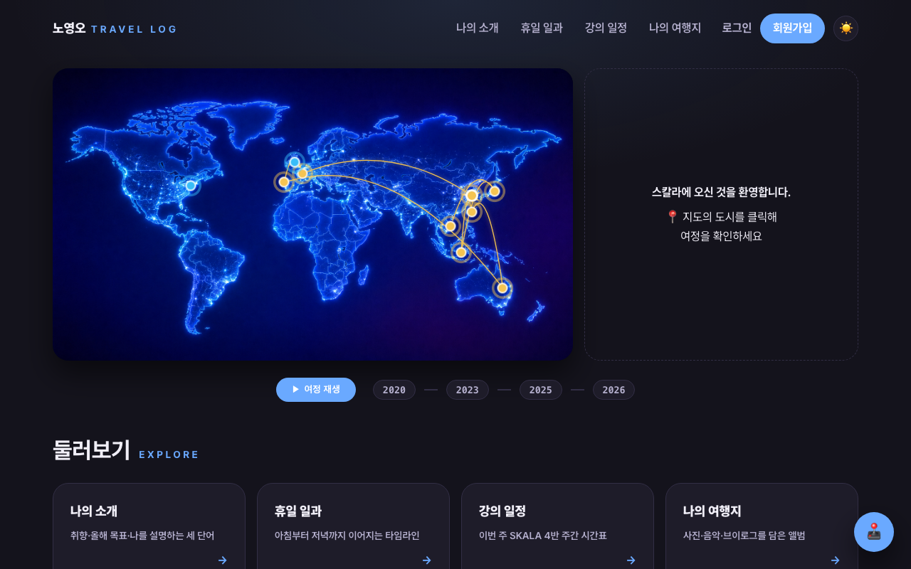
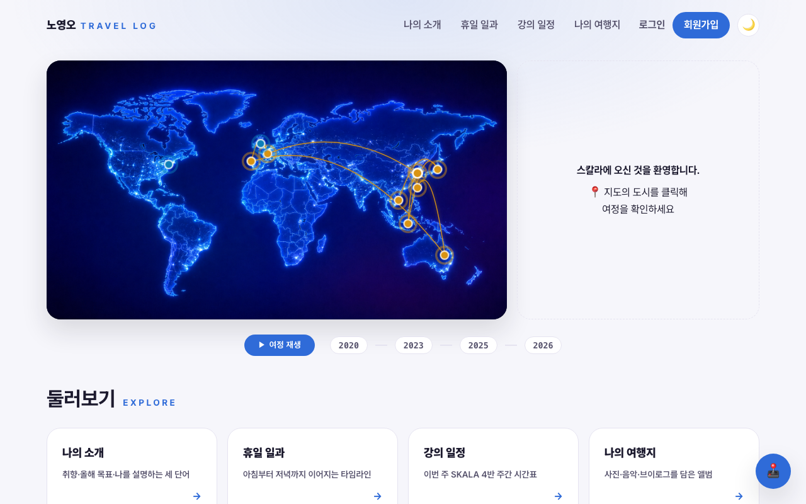
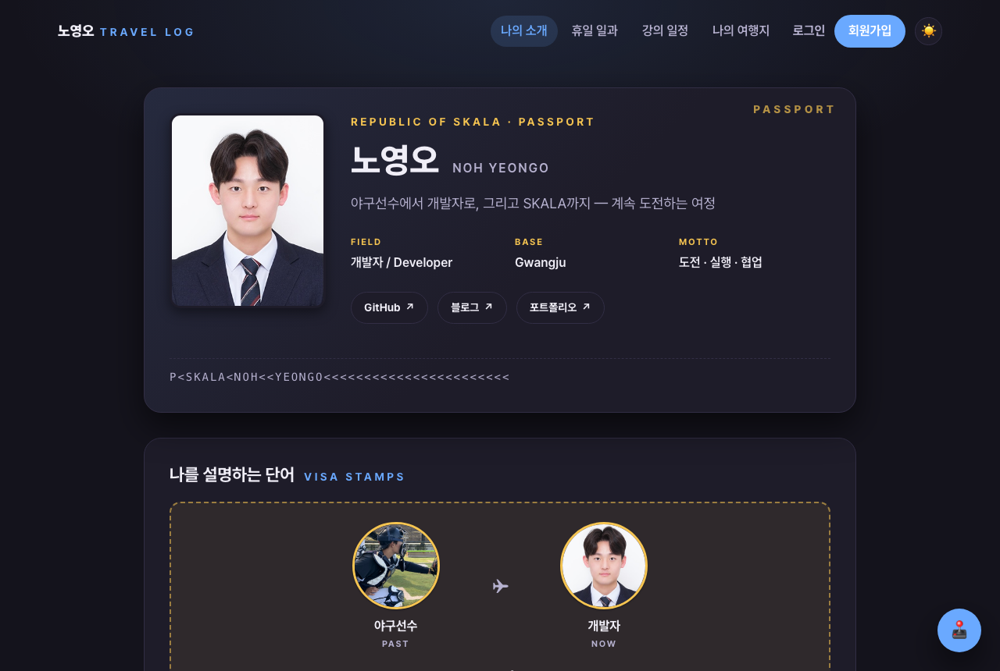
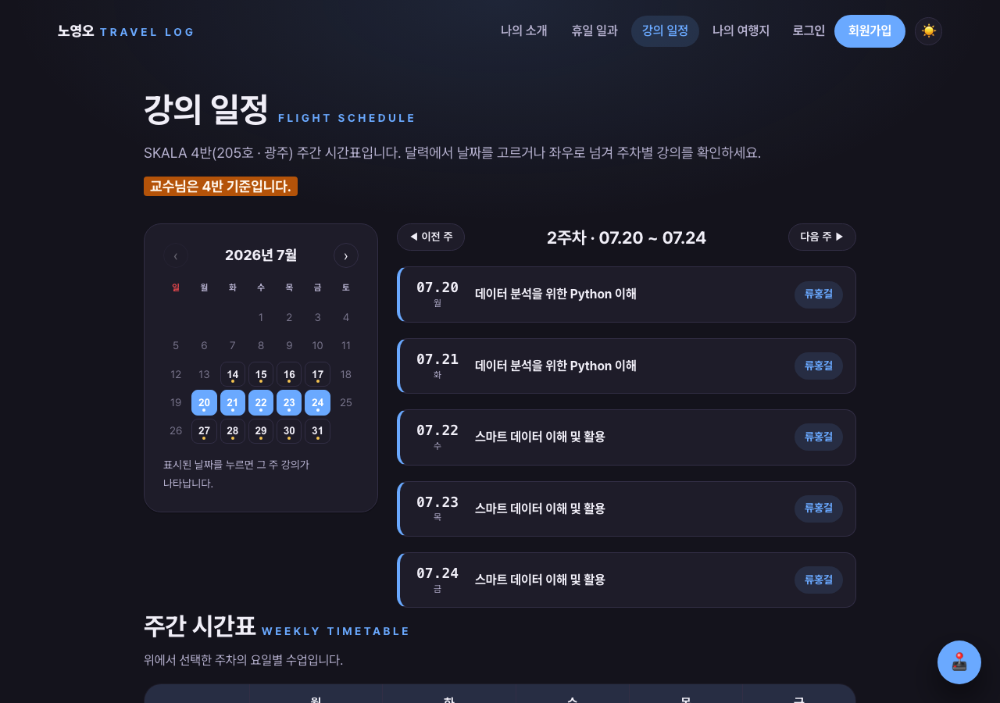
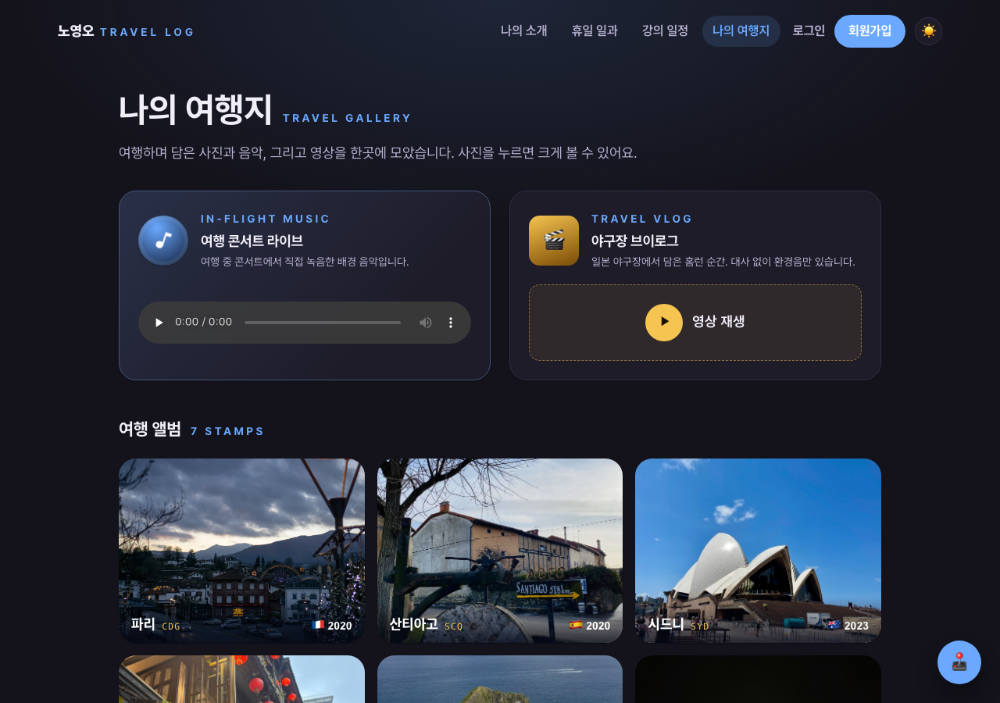
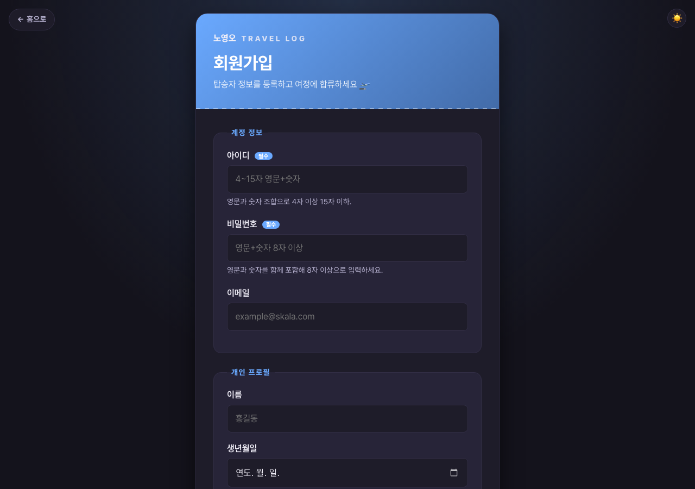
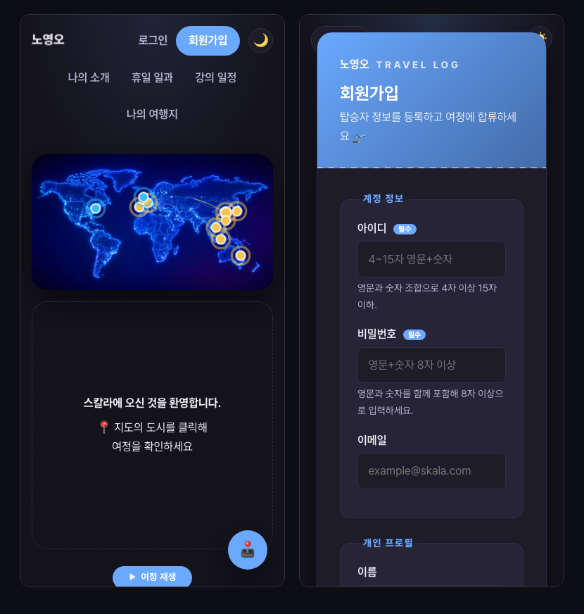

# SKALA-FRONT · 여행 일지 포털

순수 HTML/CSS/JavaScript로만 만든 개인 포털입니다. 강의 8개 챕터를 따라 하나의 사이트를
점진적으로 발전시키고, 마지막에 **여행 일지(Travel Log)** 테마로 전면 리뉴얼했습니다.
외부 라이브러리·프레임워크·CDN·빌드 도구 없이 정적 파일로만 동작합니다.

**🛫 최종 배포** → https://skala.beta-app.kr

## 챕터별 진행 과정

각 챕터를 마친 시점의 결과물을 그대로 배포해 두었습니다. 챕터명을 누르면 요구사항·완료
내용·추가 진행을 정리한 문서가, "보기"를 누르면 당시 모습이 열립니다.

| 챕터 | 내용 | 결과 보기 | PR |
|---|---|---|---|
| [1. Web 개요](chapters/ch1/README.md) | 프로젝트 구성과 index.html | [보기](https://skala.beta-app.kr/chapters/ch1/html/index.html) | [#1](https://github.com/NohYeongO/skala-front/pull/1) |
| [2. HTML 기초](chapters/ch2/README.md) | 소개·휴일 일과·강의 일정 페이지 | [보기](https://skala.beta-app.kr/chapters/ch2/html/index.html) | [#2](https://github.com/NohYeongO/skala-front/pull/2) |
| [3. HTML Form](chapters/ch3/README.md) | 회원가입·완료 페이지 | [보기](https://skala.beta-app.kr/chapters/ch3/html/index.html) | [#3](https://github.com/NohYeongO/skala-front/pull/3) |
| [4. HTML 심화](chapters/ch4/README.md) | 여행지(오디오·비디오)와 포털 허브 | [보기](https://skala.beta-app.kr/chapters/ch4/html/index.html) | [#4](https://github.com/NohYeongO/skala-front/pull/4) |
| [5. CSS 기초](chapters/ch5/README.md) | style.css·디자인 토큰·웹폰트 | [보기](https://skala.beta-app.kr/chapters/ch5/html/index.html) | [#5](https://github.com/NohYeongO/skala-front/pull/5) |
| [6. CSS 심화](chapters/ch6/README.md) | Flex/Grid·반응형(786px)·다크모드·애니메이션 | [보기](https://skala.beta-app.kr/chapters/ch6/html/index.html) | [#6](https://github.com/NohYeongO/skala-front/pull/6) |
| [7. JS 기초](chapters/ch7/README.md) | 업다운 게임·성적 계산기·내 가방 | [보기](https://skala.beta-app.kr/chapters/ch7/html/index.html) | [#7](https://github.com/NohYeongO/skala-front/pull/7) |
| [8. JS 심화](chapters/ch8/README.md) | 실시간 날씨(fetch/async)·모듈 분리 | [보기](https://skala.beta-app.kr/chapters/ch8/html/index.html) | [#8](https://github.com/NohYeongO/skala-front/pull/8) |
| 최종 | 여행 일지 테마 전면 리뉴얼 | [보기](https://skala.beta-app.kr) | [#9](https://github.com/NohYeongO/skala-front/pull/9) [#10](https://github.com/NohYeongO/skala-front/pull/10) [#11](https://github.com/NohYeongO/skala-front/pull/11) |

## 프로젝트 포인트

### 접근성 (WCAG AA)
- 색 대비 19개 조합을 직접 계산해 라이트/다크 모두 **AA 이상**(본문은 AAA) 확인
- 네이티브 `<dialog>`로 포커스 트랩·복원, `aria-live` 상태 안내, skip-link·랜드마크·헤딩 계층
- `prefers-reduced-motion` 사용자는 인트로·등장·플립 애니메이션 없이 이용
- JS가 없어도 헤더 내비게이션과 본문을 그대로 열람할 수 있는 점진적 향상 구조

### 반응형 (Mobile First)
- 강의 지정 **786px 분기** 준수, 375px 폭까지 레이아웃 검증
- 시간표처럼 줄이면 읽기 어려운 표는 축소 대신 가로 스크롤로 처리

### 페이지 전환 경험
- 헤더는 정적 마크업 + 자리 예약, 인트로는 첫 페인트 전에 선행 로드
  → 페이지를 오갈 때 **깜빡임과 레이아웃 밀림이 없습니다**
- 스크롤 등장 애니메이션은 접힌 섹션에만 적용해 보이는 콘텐츠는 즉시 표시
- 출국 수속 인트로는 세션당 1회만 재생, 웹폰트 preload로 글꼴 전환 최소화

### 실시간 데이터 다루기
- Open-Meteo 날씨를 fetch/async-await로 호출하고 **sessionStorage에 캐시**해
  같은 세션에서는 API를 다시 부르지 않습니다
- 도시를 빠르게 연속 클릭해도 **토큰 비교로 늦게 도착한 응답을 폐기**해
  화면이 이전 요청 결과로 덮이지 않습니다

### 브라우저 스토리지 설계
- **localStorage** — 계정·로그인 세션, 게임 기록(업다운 랭킹·날짜별 성적·가방), 테마 선택처럼
  다시 방문해도 유지할 상태를 저장
- **sessionStorage** — 날씨 캐시, 인트로·브랜드 애니메이션 재생 여부처럼 세션 동안만 필요한
  상태를 분리해 저장
- 저장값이 지워지거나 조작돼도 안전 — try/catch와 배열 타입 가드로 파싱 실패 시 기본값으로 복귀

### 구조·보안
- 프레임워크 없이 역할별 모듈 분리 — 게임 5모듈, 날씨 데이터(weatherAPI)/화면 분리, config 단일 출처
- `style.css` 하나로 공통 레이어(토큰→기본→뼈대→게임)를 순서 보장해 불러오는 진입 구조
- 전 페이지 CSP 적용, 사용자 입력은 `escapeHTML`·`textContent`로만 렌더링, iframe sandbox 최소 권한
- 외부 요청 최소화 — Pretendard 셀프호스팅, 외부 라이브러리·CDN **0개**

### 디테일
- 분할플랩 도시 코드, 여권 스탬프, 항로를 나는 비행기 같은 마이크로 인터랙션
- 달력·셀렉트·라디오 등 네이티브 컨트롤까지 `color-scheme`으로 테마 연동
- 미니게임 3종은 어느 페이지에서든 플로팅 런처로 실행, 기록은 localStorage에 저장

### 개발 과정
- 챕터마다 브랜치 → PR → 머지로 진행하고, 각 시점의 결과물을 스냅샷으로 배포해
  **성장 과정을 링크 하나로 확인**할 수 있게 정리
- 색 대비 계산, 모바일 폭 실측, 헤드리스 브라우저 렌더 확인 등 **측정 기반으로 검증**

## 화면 둘러보기

| 다크 모드 (기본) | 라이트 모드 |
|---|---|
|  |  |

세계지도 위에 방문 도시를 마커로 찍고, 항로를 따라 비행기가 날아갑니다. 도시를 고르면
탑승권 형태의 여정 로그가 열리고, 분할플랩으로 도시 코드가 뒤집히며 실시간 날씨가 함께
표시됩니다. 테마는 시스템 설정을 따라가고 토글로 직접 바꿀 수도 있습니다.

### 여권 프로필



나의 소개를 여권 컨셉으로 풀었습니다. MRZ(기계판독영역) 표기, 비자 스탬프처럼 찍힌
"나를 설명하는 단어들", 야구선수에서 개발자로 이어지는 도전 스토리를 담았습니다.

### 강의 일정 — 달력 연동 주간 뷰어



달력에서 날짜를 고르거나 좌우로 넘기면 그 주의 강의가 나타납니다. 아래에는 선택한
주차의 수업을 요일별로 펼친 주간 시간표가 함께 갱신됩니다(점심시간만 셀 병합).

### 여행 갤러리



여행 사진·콘서트 음악·야구장 브이로그를 한곳에 모았습니다. 사진을 누르면 여권 스탬프
애니메이션과 함께 라이트박스로 크게 열립니다.

### 탑승권 회원가입 · 모바일

| 탑승권 회원가입 | 모바일 (375px) |
|---|---|
|  |  |

회원가입은 탑승권 절취선 디자인에 조건식 검증(아이디·비밀번호 정규식)을 더했고,
전 페이지가 375px 폭까지 자연스럽게 반응합니다.

## 폴더 구조

```
skala-front/
├─ index.html                  # 로딩 화면 → 여행 일지 홈으로 이동
├─ html/
│  ├─ index.html               # 여행 궤적 지도 홈
│  ├─ myProfile.html           # 여권 프로필
│  ├─ holiday.html             # 하루 여정 타임라인
│  ├─ myClass.html             # 달력 연동 주간 시간표
│  ├─ myTrip.html              # 여행 갤러리
│  └─ login.html · signUp.html · signUpResult.html
├─ css/
│  ├─ style.css                # 공통 진입 (tokens → base → chrome → games)
│  ├─ tokens.css               # 디자인 토큰 · 웹폰트
│  ├─ base.css                 # 리셋 · 기본 타이포 · 접근성 유틸
│  ├─ chrome.css               # 헤더 · 푸터 · 스킵링크 · 스크롤 등장
│  ├─ games.css                # 미니게임 런처 · 모달
│  └─ home / profile / holiday / myClass / trip / auth / intro.css
├─ script/
│  ├─ layout.js · theme.js · intro.js · reveal.js     # 공통 뼈대
│  ├─ journeyMap.js · journeyLog.js · cities.js       # 지도 · 여정 로그
│  ├─ weatherAPI.js · realtimeInfo.js                 # 날씨 (데이터/화면 분리)
│  ├─ games.js · gameModal.js · upDown.js · grade.js · bag.js
│  └─ auth.js · authUI.js · login.js · signup.js · scheduleData.js
├─ media/                      # 사진 · 음악 · 브이로그
├─ fonts/                      # Pretendard Variable (셀프호스팅)
├─ screenshots/                # README 미리보기 이미지
└─ chapters/                   # 챕터별 결과물 스냅샷
   └─ ch1 ~ ch8/               # 각 폴더에 요구사항 · 완료 · 추가 진행 README
```
