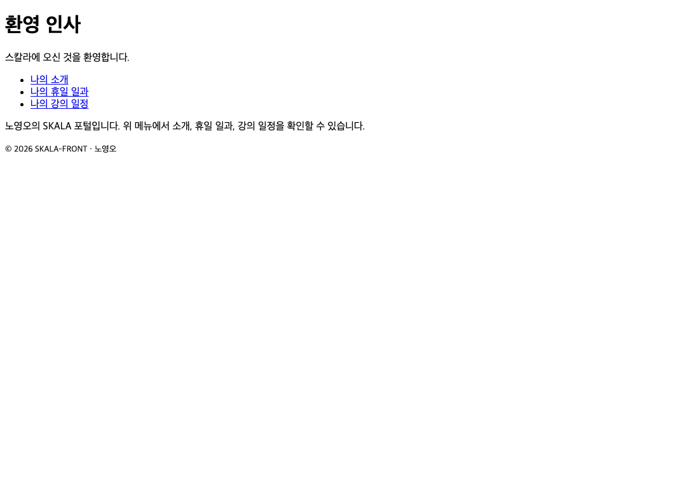

# 2장 · HTML 기초

> 이 폴더는 2장을 마친 시점의 결과물 스냅샷입니다.
>
> **데모**: https://skala.beta-app.kr/chapters/ch2/html/index.html
>
> **PR**: https://github.com/NohYeongO/skala-front/pull/2

## 과제 요구사항
- `holiday.html` — h1·h2·br·p·mark 필수 사용
- `myProfile.html` — ul(좋아하는 음식)·ol(올해 할 일)·dl(나를 설명하는 단어), CSS 금지
- `myClass.html` — table/thead/tbody/td, 2시간 이상 강의·점심시간 셀 병합, CSS 금지
- `index.html` — 각 페이지 바로가기(a)

## 완료 내용
- 세 페이지 모두 필수 요소를 사용해 CSS 없이 마크업만으로 작성
- 시간표는 colspan·rowspan으로 연강·점심시간 병합

## 추가 진행
- header/main/section/footer 랜드마크로 문서 구조화
