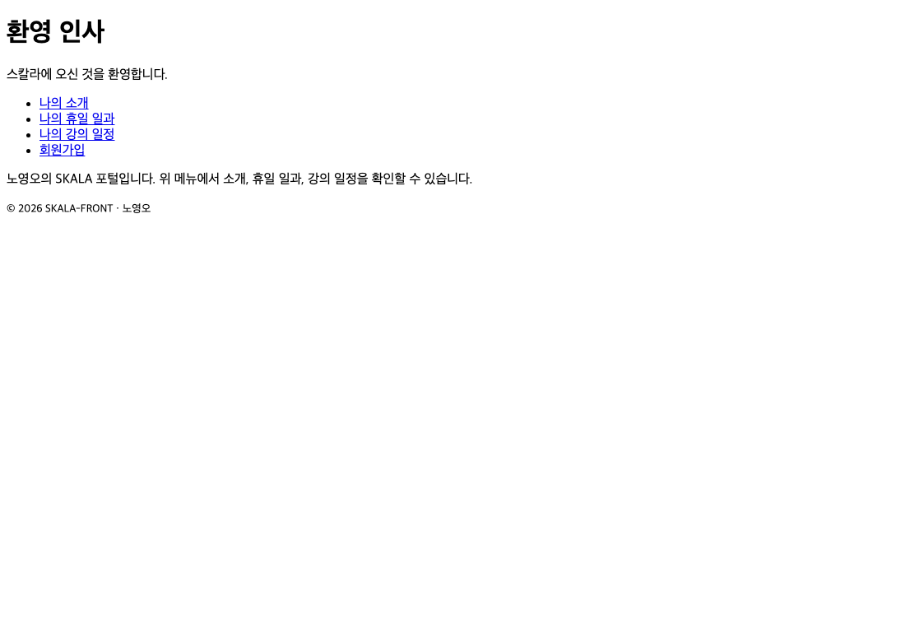

# 3장 · HTML Form

> 이 폴더는 3장을 마친 시점의 결과물 스냅샷입니다.
>
> **데모**: https://skala.beta-app.kr/chapters/ch3/html/index.html
>
> **PR**: https://github.com/NohYeongO/skala-front/pull/3

## 과제 요구사항
- `signUp.html` — form(action="signUpResult.html", method="get"), fieldset/legend/label,
  input(placeholder·required), select/option/textarea, submit/reset
- `signUpResult.html` — 가입 버튼 클릭 시 이동하는 완료 페이지

## 완료 내용
- 요구된 폼 요소 전부 사용해 회원가입 흐름 구성, GET 전송으로 완료 페이지 이동

## 추가 진행
- 모든 입력에 label 연결, email·date·radio·checkbox 등 다양한 input 타입 활용
