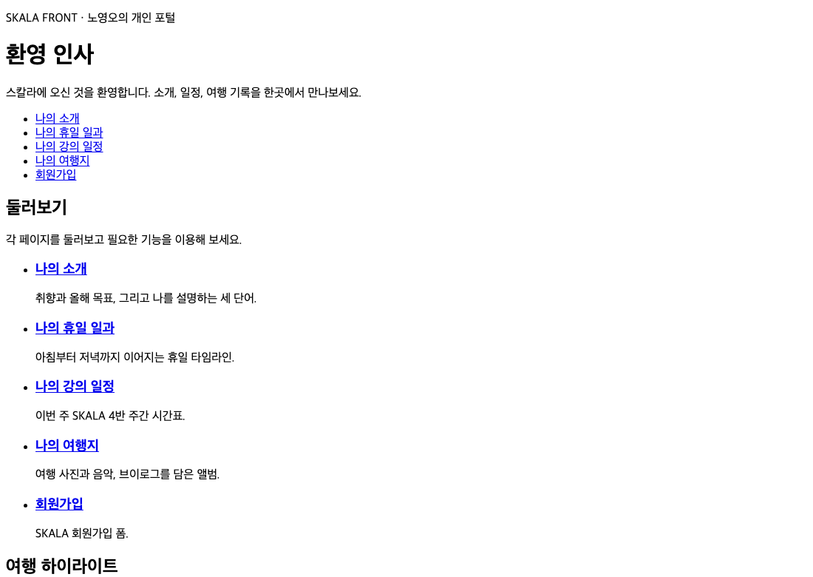

# 4장 · HTML 심화

> 이 폴더는 4장을 마친 시점의 결과물 스냅샷입니다.
>
> **데모**: https://skala.beta-app.kr/chapters/ch4/html/index.html
>
> **PR**: https://github.com/NohYeongO/skala-front/pull/4

## 과제 요구사항
- `myTrip.html` — audio(source)·img·video(source) 필수 사용, `media` 리소스 폴더
- `index.html` — nav(메뉴)·main(본문)·aside(사이드바)로 포털 허브 개편

## 완료 내용
- 여행지 페이지에 사진·배경 음악·영상 배치, 메인을 포털 허브로 재구성

## 추가 진행
- 모든 이미지에 alt 텍스트, 미디어 controls 제공, aside에 프로필·부가 정보 구성
