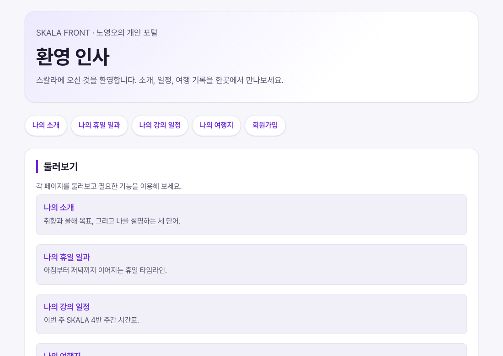

# 5장 · CSS 기초

> 이 폴더는 5장을 마친 시점의 결과물 스냅샷입니다.
>
> **데모**: https://skala.beta-app.kr/chapters/ch5/html/index.html
>
> **PR**: https://github.com/NohYeongO/skala-front/pull/5

## 과제 요구사항
- 미션1 — `/css/style.css` 생성, 전체 글꼴·줄간격·색·배경, h1/h2 강조, 링크 스타일,
  모든 HTML에서 style.css 적용
- 미션2 — 박스 모델: 컨테이너 정렬, 여행 리뷰 카드, 시간표 테이블 꾸미기
- 미션3 — 회원가입 폼 스타일링(입력창·fieldset·버튼)

## 완료 내용
- `css/style.css` 공통 진입 스타일시트를 모든 HTML이 링크
- 전체 테마·타이포·카드·테이블·폼 스타일 완성

## 추가 진행
- CSS 변수 기반 디자인 토큰 시스템(tokens/base/components 레이어)
- 구글 폰트 대신 Pretendard를 셀프호스팅해 외부 요청 없이 웹폰트 적용
