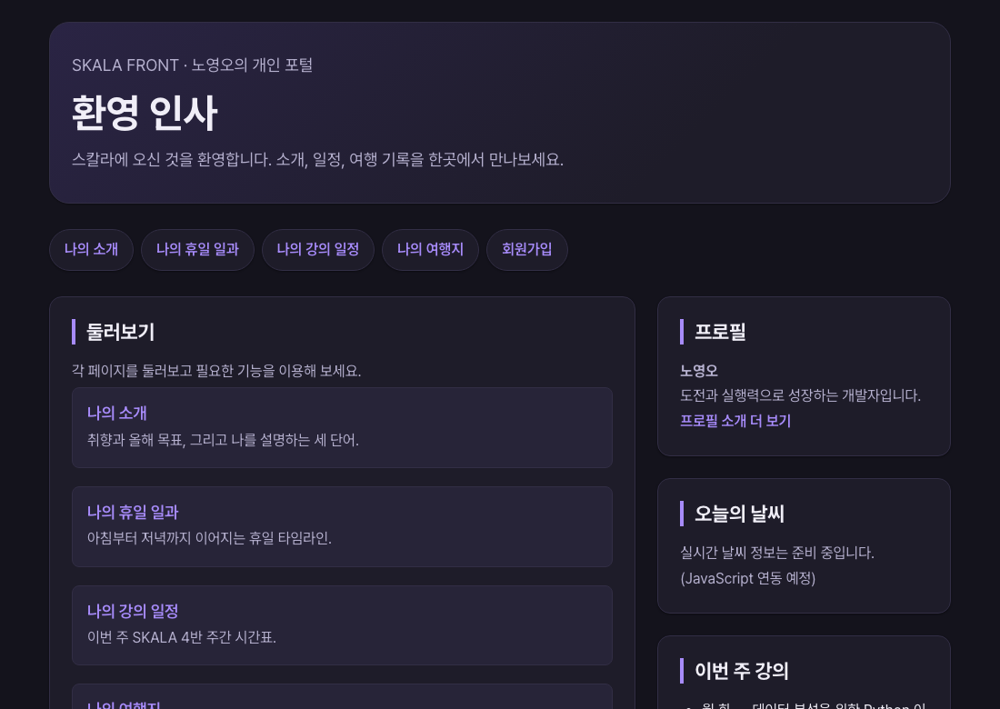

# 6장 · CSS 심화

> 이 폴더는 6장을 마친 시점의 결과물 스냅샷입니다.
>
> **데모**: https://skala.beta-app.kr/chapters/ch6/html/index.html
>
> **PR**: https://github.com/NohYeongO/skala-front/pull/6

## 과제 요구사항
- 미션4 — Flexbox·Grid: 바로가기 가로 배치, main|aside 2단, 여행 카드 3열 바둑판
- 미션5 — 반응형: 786px 이하에서 세로 1열 전환
- 미션6 — 애니메이션: hover 부드러운 전환, 카드 부양·그림자, 헤더 타이틀 페이드인

## 완료 내용
- Flex/Grid 레이아웃과 786px 분기, hover·페이드인 애니메이션 적용

## 추가 진행
- 다크모드 — 시스템 설정 자동 감지 + 수동 토글(localStorage 기억)
- prefers-reduced-motion 사용자를 위한 애니메이션 비활성화
