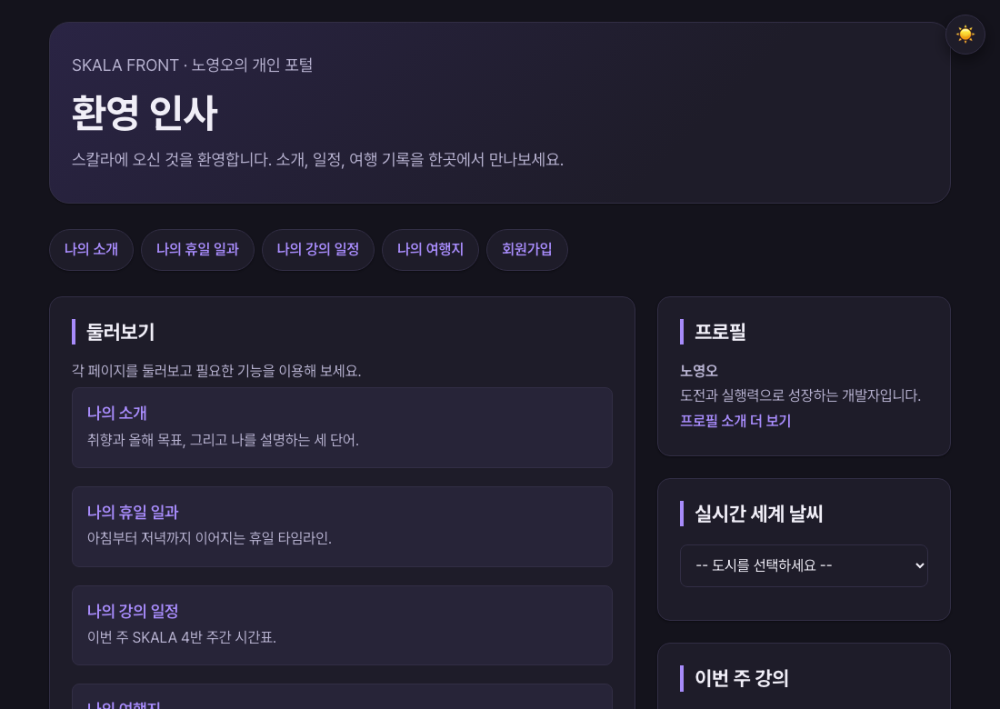

# 8장 · JavaScript 심화

> 이 폴더는 8장을 마친 시점의 결과물 스냅샷입니다.
>
> **데모**: https://skala.beta-app.kr/chapters/ch8/html/index.html
>
> **PR**: https://github.com/NohYeongO/skala-front/pull/8

## 과제 요구사항
- index 사이드바에 도시 select와 weather-box 추가
- change 이벤트로 도시 이름·좌표를 DOM에 표시
- fetch/async-await로 Open-Meteo 날씨 요청, 로딩 표시 후 온도·습도 렌더링
- `weatherAPI.js`(데이터)·`realtimeInfo.js`(화면) 모듈 분리, module 스크립트로 로드

## 완료 내용
- 실시간 날씨 위젯을 3단계(DOM → 비동기 → 모듈 분리) 그대로 구현

## 추가 진행
- 다크모드 토글 스크립트를 전 페이지에 연결
- 이후 최종 리뉴얼에서 여정 지도·탑승권 날씨로 발전 (모듈 분리 산출물은 보존)
